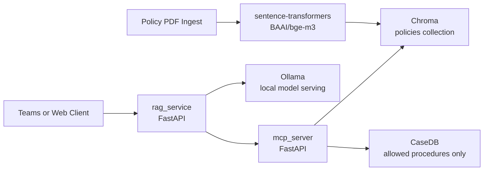

# state-policy-rag-starter


`state-policy-rag-starter` is a starter repository for a retrieval-augmented generation workflow that helps state agencies answer policy questions using approved policy text and tightly scoped case data access.

## What It Does

- Ingests policy PDFs into a Chroma vector store.
- Exposes an MCP service for policy search and a strict SQL stored procedure allowlist.
- Runs a RAG service that only answers from approved context and requires citations.
- Uses Ollama for in-state model serving so policy and case data do not leave state-controlled infrastructure.
- Provides a starter governance, deployment, and security package for State IT, Legal, and Procurement teams.

## Why This Starter

- Cost target: less than `$15K` for a starter deployment on a single state-managed VM plus implementation time.
- Data stays in-state: documents, vectors, prompts, and generated answers stay on infrastructure operated by or for the agency.
- Procurement-ready framing: see [SECURITY.md](/Volumes/HappyFam/state-policy-rag-starter/docs/SECURITY.md) and [DEPLOY_STATE.md](/Volumes/HappyFam/state-policy-rag-starter/docs/DEPLOY_STATE.md).

## 5-Minute Quickstart

1. Clone the repository and enter it.

```bash
git clone <your-fork-or-repo-url>
cd state-policy-rag-starter
```

2. Create a local environment file.

```bash
cp .env.example .env
```

3. Start the stack.

```bash
docker-compose up --build
```

4. In a second shell, ingest a first policy PDF.

```bash
python3 ingest/ingest.py \
  --file examples/sample_policy.pdf \
  --source_name "Sample Policy" \
  --section "General"
```

5. Test the RAG endpoint.

```bash
curl -X POST http://localhost:8081/ask \
  -H "Content-Type: application/json" \
  -H "user: test.user@state.gov" \
  -d '{"query":"What does policy say about termination of rights?"}'
```

## Architecture



## Repo Map

- [README.md](/Volumes/HappyFam/state-policy-rag-starter/README.md): project overview and quickstart
- [GOVERNANCE.md](/Volumes/HappyFam/state-policy-rag-starter/GOVERNANCE.md): usage, privacy, citation, and audit requirements
- [SECURITY.md](/Volumes/HappyFam/state-policy-rag-starter/docs/SECURITY.md): threat model and technical controls
- [DEPLOY_STATE.md](/Volumes/HappyFam/state-policy-rag-starter/docs/DEPLOY_STATE.md): step-by-step single-VM deployment guide

## Intended Outcome

This starter is designed for agencies that need a practical path to policy-grounded assistance without sending protected data to external hosted LLM services and without allowing open-ended SQL access.
