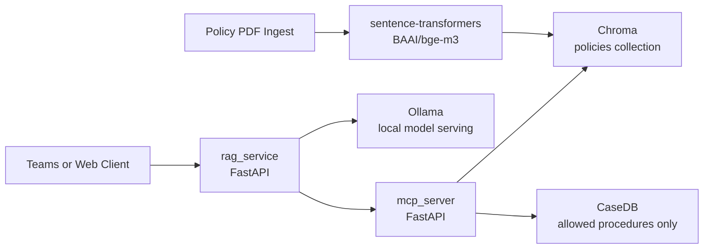

# state-policy-rag-starter


`state-policy-rag-starter` is a starter repository for a retrieval-augmented generation workflow that helps state agencies answer policy questions using approved policy text and tightly scoped case data access.

## What It Does

- Ingests policy PDFs into a Chroma vector store.
- Exposes an MCP service for policy search and a strict SQL stored procedure allowlist.
- Runs a RAG service that only answers from approved context and requires citations.
- Uses Ollama for in-state model serving so policy and case data do not leave state-controlled infrastructure.
- Provides a starter governance, deployment, and security package for State IT, Legal, and Procurement teams.

## Why This Starter

- Cost target: less than `$15K` for a starter deployment on a single state-managed VM plus implementation time.
- Data stays in-state: documents, vectors, prompts, and generated answers stay on infrastructure operated by or for the agency.
- Procurement-ready framing: see [Security](docs/SECURITY.md), [Deployment](docs/DEPLOY_STATE.md), [Architecture](docs/ARCHITECTURE.md), and [Hardware Setup](docs/HARDWARESETUP.md).

## Implemented Features

- Core project scaffolding and Docker-based service configuration for local and pilot deployments
- RAG service implementation with strict temperature control and citation enforcement
- MCP server integration supporting policy search, SQL whitelisting, and audit logging
- Dedicated ingestion pipeline for extracting, chunking, embedding, and indexing policy documents

## 5-Minute Quickstart

1. Clone the repository and enter it.

```bash
git clone <your-fork-or-repo-url>
cd state-policy-rag-starter
```

2. Create a local environment file.

```bash
cp .env.example .env
```

3. For local development, set a Hugging Face read token in `.env` if model downloads are needed.

```bash
echo 'HF_TOKEN=your_huggingface_read_token' >> .env
```

4. Start the stack.

```bash
docker-compose up --build
```

5. In a second shell, install ingest dependencies if needed and ingest a first policy PDF.

```bash
python3 -m pip install -r ingest/requirements.txt
CHROMA_PORT=8001 EMBEDDING_MODEL=sentence-transformers/all-MiniLM-L6-v2 \
python3 ingest/ingest.py \
  --file examples/sample_policy.pdf \
  --source_name "Sample Policy" \
  --section "General"
```

6. Test semantic search.

```bash
curl -X POST http://localhost:8080/search_policies \
  -H "Content-Type: application/json" \
  -H "user: test.user@state.gov" \
  -d '{"query":"What does the policy require DCYF to display on the website home page?"}'
```

7. Test the RAG endpoint.

```bash
curl -X POST http://localhost:8081/ask \
  -H "Content-Type: application/json" \
  -H "user: test.user@state.gov" \
  -d '{"query":"What does policy say about termination of rights?"}'
```

## Architecture



## Repo Map

- [README.md](README.md): project overview and quickstart
- [GOVERNANCE.md](GOVERNANCE.md): usage, privacy, citation, and audit requirements
- [docs/ARCHITECTURE.md](docs/ARCHITECTURE.md): runtime topology, diagrams, trust boundaries, and request flows
- [docs/HARDWARESETUP.md](docs/HARDWARESETUP.md): hardware sizing and isolated network guidance for Azure or on-prem
- [docs/SECURITY.md](docs/SECURITY.md): threat model and technical controls
- [docs/DEPLOY_STATE.md](docs/DEPLOY_STATE.md): step-by-step single-VM deployment guide
- [docs/AUTOMATED_INGESTION.md](docs/AUTOMATED_INGESTION.md): ETL design for scheduled policy refresh and vector synchronization

## Deployment Planning Docs

- [Architecture Guide](docs/ARCHITECTURE.md) for deployment, sequence, class, and state diagrams
- [Hardware Setup Guide](docs/HARDWARESETUP.md) for VM sizing, storage, and network isolation recommendations
- [Security Guide](docs/SECURITY.md) for threat model and mitigations
- [State Deployment Guide](docs/DEPLOY_STATE.md) for pilot rollout steps
- [Automated Ingestion Guide](docs/AUTOMATED_INGESTION.md) for the planned scheduled refresh pipeline

## Local Development Notes

- `docker-compose` is the validated local command path for this repo
- local ingest writes to host-exposed Chroma on port `8001`
- the ingest embedding model and MCP search embedding model must match
- if you change `EMBEDDING_MODEL`, delete and recreate the `policies` collection before re-ingesting
- `HF_TOKEN` helps avoid slow or rate-limited Hugging Face downloads during first-time model setup

## Future Roadmap

- Advanced Semantic Search: improve retrieval precision with re-ranking models layered on top of vector search
- Automated Data Refresh: move from manual ingestion to a scheduled and repeatable pipeline
- Expanded Policy Coverage: support additional policy formats such as HTML and DOCX alongside PDF
- Enhanced UI/UX: develop a dedicated frontend for policy exploration and guided question workflows

## Open Source And Feedback

This repository is meant to be open and practical.

- Feel free to fork it for your own agency, internal prototype, or public-sector adaptation
- Feedback is welcome from State IT, architects, legal teams, security reviewers, and builders working on responsible AI
- Issues, suggestions, and improvements are all useful, especially around governance, deployment, and in-state operating models

## Intended Outcome

This starter is designed for agencies that need a practical path to policy-grounded assistance without sending protected data to external hosted LLM services and without allowing open-ended SQL access.

If this repository is useful, please consider forking it, sharing feedback, and giving it a star on GitHub.
