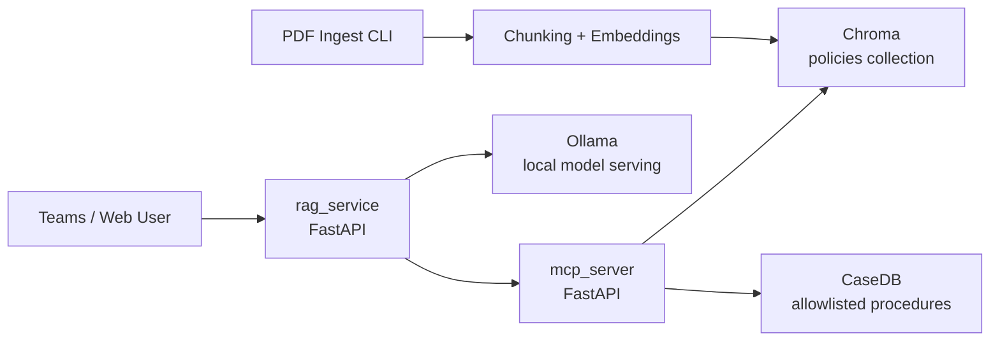
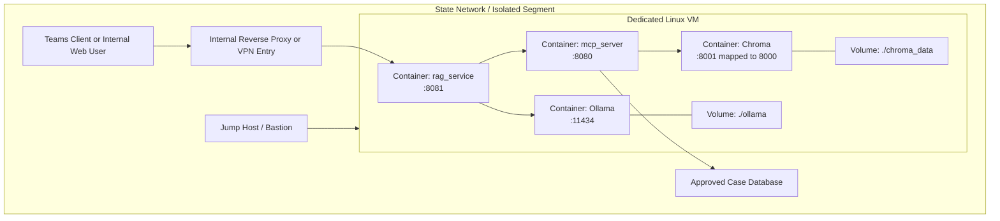
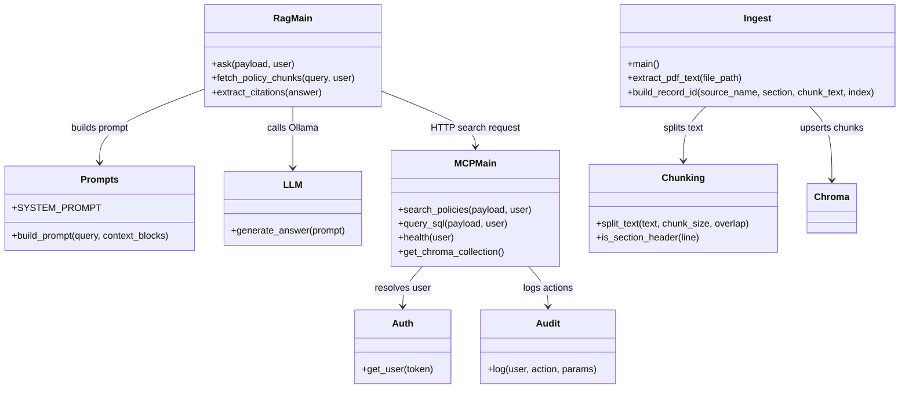
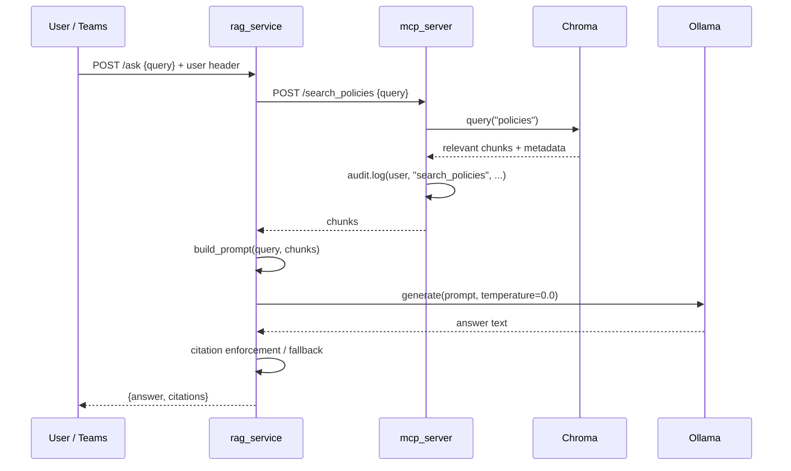
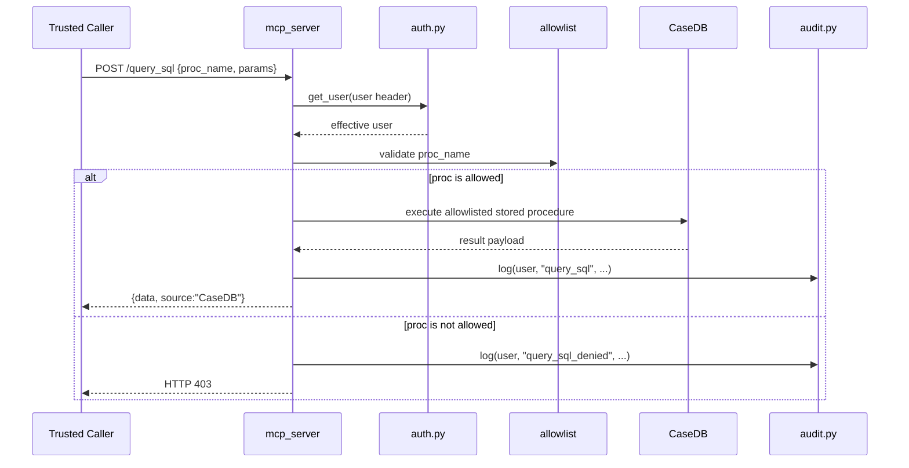
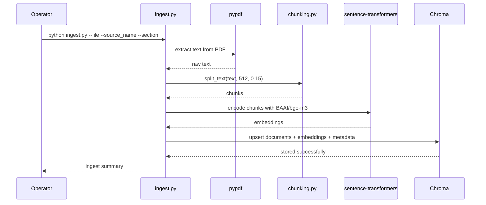
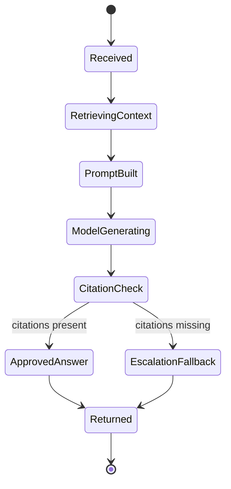
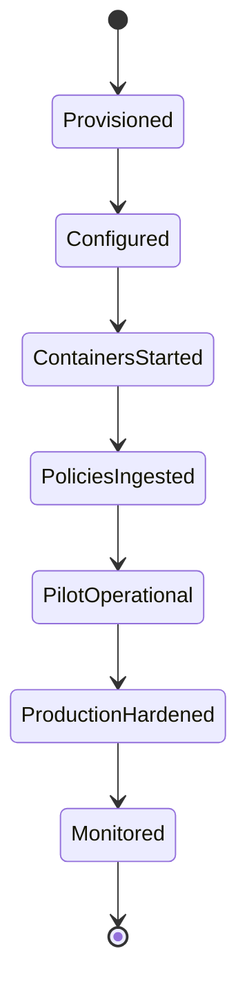

# Architecture

This document describes the runtime architecture, deployment model, core components, and key interaction flows for `state-policy-rag-starter`.

The design goal is to give State IT, Legal, Security, and Engineering teams a shared technical model for how the system operates and where governance and control points exist.

## 1. Architecture Goals

- Keep policy and prompt data inside state-controlled infrastructure
- Separate retrieval, model inference, and controlled system access
- Prevent open-ended SQL access
- Enforce citation-based responses
- Support isolated deployment on Azure or on-prem virtual machines
- Produce audit-ready request trails

## 2. High-Level Logical View

## 3. Deployment Diagram

The pilot deployment is intentionally simple: one isolated VM running multiple containers, with access mediated through a private network segment.

## 4. Network Trust Boundaries

There are three primary trust boundaries in this architecture:

1. User boundary
   External users or internal end users access the service through Teams, a web UI, or an internal reverse proxy.

2. Application boundary
   The `rag_service` and `mcp_server` containers operate as separate services so retrieval and controlled data access are not collapsed into a single runtime path.

3. Sensitive systems boundary
   Chroma, Ollama, and CaseDB hold or process sensitive content and should only be reachable from the application layer over explicitly allowed network paths.

## 5. Component Responsibilities

### rag_service

- Receives end-user questions
- Calls the MCP service for policy retrieval
- Builds the grounded prompt
- Calls Ollama with temperature fixed to `0.0`
- Enforces citation-based answer rules
- Returns the final answer and extracted citations

### mcp_server

- Provides policy search over the `policies` Chroma collection
- Provides controlled SQL access via an allowlist of stored procedures
- Resolves effective user identity
- Emits audit events for every endpoint

### Chroma

- Stores policy chunks and associated metadata
- Supports retrieval by semantic similarity
- Persists vector data on local volume storage

### Ollama

- Hosts local LLM inference
- Keeps model execution inside the agency environment
- Supports low-temperature deterministic generation

### ingest CLI

- Extracts text from PDF files
- Splits text into overlapping chunks
- Generates embeddings using `BAAI/bge-m3`
- Upserts chunk documents and metadata into Chroma

## 6. Component/Class Diagram

This is a simplified code-level view of the most important modules and their responsibilities.

## 7. Sequence Diagram: Question Answering Flow

This is the primary runtime path for end-user questions.

## 8. Sequence Diagram: Controlled SQL Flow

This is the protected path for case-data lookups through approved stored procedures only.

## 9. Sequence Diagram: Ingestion Flow

This flow loads approved policy documents into the vector store.

## 10. State Diagram: Question Lifecycle

This state diagram shows how a user question moves through the policy-grounded answer path.

## 11. State Diagram: Deployment Lifecycle

This summarizes how an agency typically moves from pilot setup to operational use.

## 12. Data Model Summary

### Policy Chunk

- `document`: chunk text
- `metadata.source`: policy or source name
- `metadata.section`: policy section
- `embedding`: semantic vector for retrieval
- `id`: deterministic record identifier

### Audit Event

- `timestamp`
- `user`
- `action`
- `params`

### SQL Request

- `proc_name`
- `params`
- `source = CaseDB`

## 13. Security-Critical Design Decisions

- Retrieval and generation are separated into distinct services
- SQL access is modeled as allowlisted procedure calls only
- Citation enforcement happens after model generation
- `LLM_TEMPERATURE` is constrained to `0.0`
- Chroma telemetry is disabled
- Audit hooks exist at the MCP service boundary

## 14. Deployment Variants

### Pilot

- Single isolated VM
- Docker Compose
- Local Chroma and Ollama volumes
- Small internal user group

### Hardened Production

- Separate non-production and production environments
- Reverse proxy or API gateway in front of `rag_service`
- Centralized log forwarding
- Backup and recovery for Chroma and Ollama volumes
- Tighter egress controls and bastion-only administration

## 15. Related Documents

- [DEPLOY_STATE.md](/Volumes/HappyFam/genai-projects/state-policy-rag-starter/docs/DEPLOY_STATE.md)
- [SECURITY.md](/Volumes/HappyFam/genai-projects/state-policy-rag-starter/docs/SECURITY.md)
- [HARDWARESETUP.md](/Volumes/HappyFam/genai-projects/state-policy-rag-starter/docs/HARDWARESETUP.md)
- [GOVERNANCE.md](/Volumes/HappyFam/genai-projects/state-policy-rag-starter/GOVERNANCE.md)
